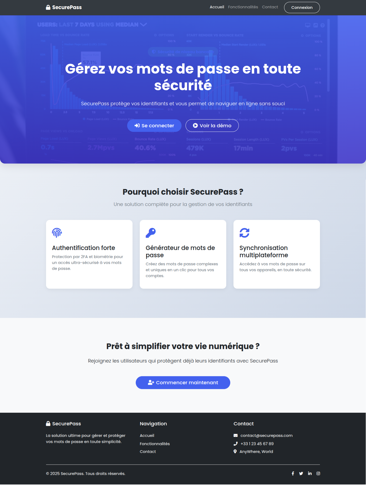
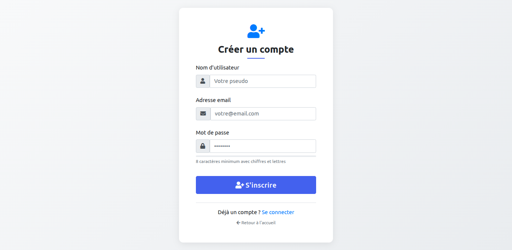
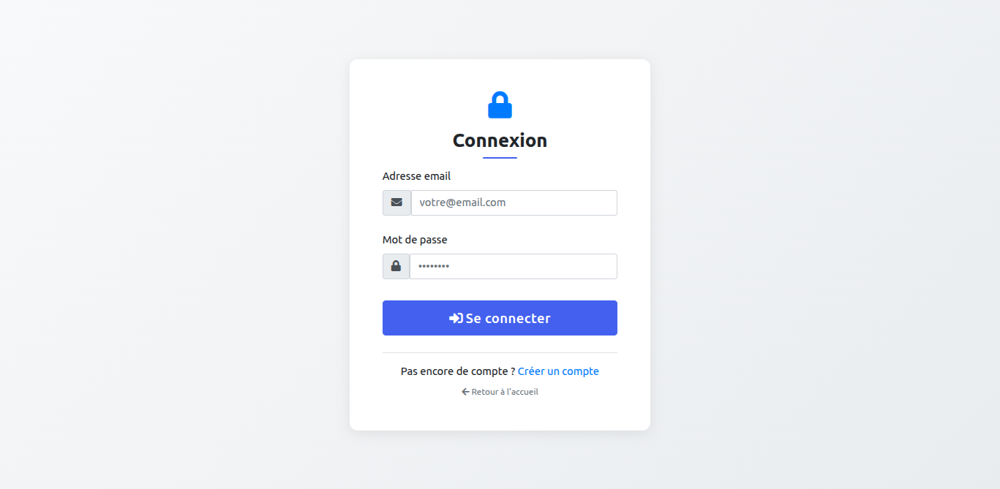
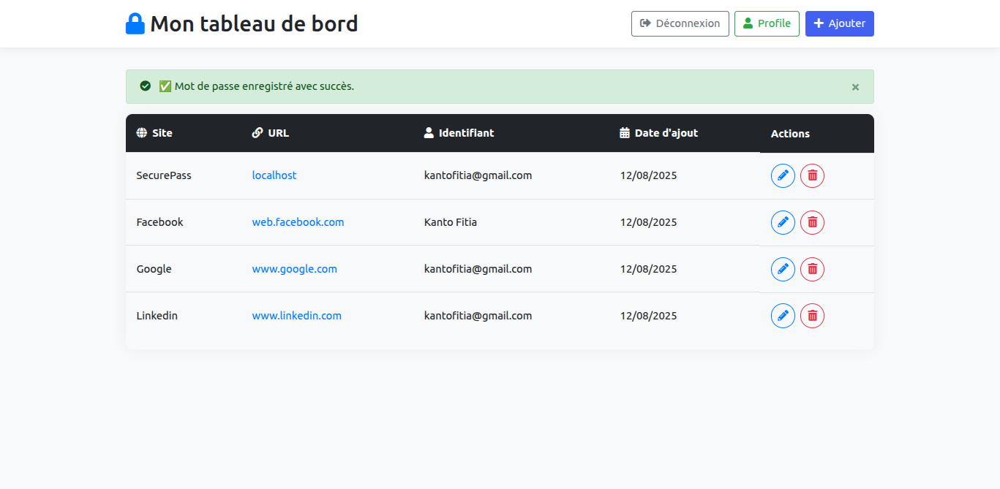
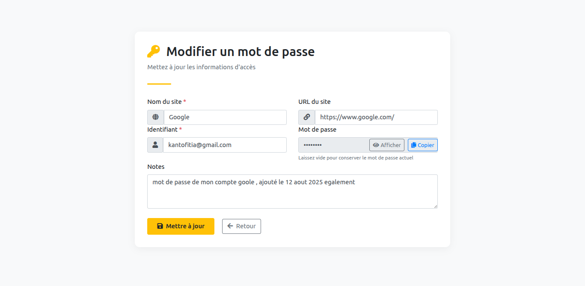

# 🚀 SecurePass – Guide d’Installation

Ce guide vous explique **deux façons simples** de tester et utiliser SecurePass sur votre machine locale :

1. **Méthode 1 – Avec Docker** : création d’un conteneur et exécution d’une image prête à l’emploi.
2. **Méthode 2 – Sans Docker** : exécution directe avec PHP et un serveur local (XAMPP / LAMP / WAMP).

---

## 📊 Tableau comparatif

| Critère                  | Méthode 1 – Avec Docker | Méthode 2 – Sans Docker |
| ------------------------ | ----------------------- | ----------------------- |
| Installation rapide      | ✅ Oui                  | ⚠️ Moyenne              |
| Config manuelle          | ❌ Minimale             | ✅ Oui                  |
| Environnement isolé      | ✅ Oui                  | ❌ Non                  |
| Requiert PHP local       | ❌ Non                  | ✅ Oui                  |
| Compatible Windows/Linux | ✅ Oui                  | ✅ Oui                  |
| Idéal pour production    | ✅ Oui                  | ⚠️ Surtout pour tests   |

---

## 📋 Prérequis

### Pour la méthode avec Docker :

- **Docker** (v20.10 ou plus récent)
- **Docker Compose** (v2.5 ou plus récent)
- **2 Go de RAM** disponibles
- **Ports libres** :
  - `8000` → Application
  - `8080` → phpMyAdmin

### Pour la méthode sans Docker :

- **PHP** (version 8.1 minimum)
- Un serveur local type **XAMPP**, **LAMP** ou **WAMP**
- **phpMyAdmin** installé sur votre machine
- **MySQL/MariaDB**

---

## 🛠️ Méthode 1 – Avec Docker

### 1️⃣ Cloner le projet

```bash
git clone https://github.com/X-jonica/docker_pass_php.git
cd docker_pass_php
```

### 2️⃣ Configurer l’environnement

Un fichier `.env` est déjà présent dans app/.env.
⚠️ **Important :** modifiez les valeurs pour correspondre à votre configuration.

```ini
# Paramètres MySQL
DB_HOST=votre_host            # ex: localhost
DB_NAME=nom_de_la_bd          # ex: manage_password
DB_USER=utilisateur_bd        # ex: root
DB_PASSWORD=mot_de_passe_bd   # ex: motdepasse123
DB_CHARSET=utf8mb4

# Paramètres applicatifs
APP_ENV=prod
APP_DEBUG=false
```

💡 **Astuce** : Utilisez un mot de passe fort et unique pour plus de sécurité.

### 3️⃣ Lancer les services

```bash
docker compose up -d
```

Cela va :

- Télécharger et construire les images nécessaires
- Lancer les conteneurs en arrière-plan
- Configurer automatiquement la base de données

### 4️⃣ Accéder aux services

- **Application** : [http://localhost:8000](http://localhost:8000)
- **phpMyAdmin** : [http://localhost:8080](http://localhost:8080)

---

## 🛠️ Méthode 2 – Sans Docker

### 1️⃣ Cloner le projet

```bash
git clone https://github.com/X-jonica/docker_pass_php.git
cd docker_pass_php/app
```

### 2️⃣ Configurer l’environnement

Ouvrez le fichier `.env` et adaptez les valeurs à votre environnement local (mêmes paramètres que pour Docker).

### 3️⃣ Importer la base de données

- Ouvrez **phpMyAdmin** depuis votre serveur local (XAMPP/LAMP/WAMP).
- Créez une nouvelle base de données avec le nom indiqué dans `.env`.
- Importez le fichier SQL fourni dans le projet (`database/schema.sql` ou équivalent).

### 4️⃣ Lancer l’application

Dans un terminal, exécutez :

```bash
php -S localhost:8000
```

### 5️⃣ Accéder à l’application

- **Application** : [http://localhost:8000](http://localhost:8000)
- **phpMyAdmin** : en fonction de votre serveur local (ex : [http://localhost/phpmyadmin](http://localhost/phpmyadmin))

## Aperçu de SecurePass

### Page d'accueil



### Page d'inscription



### Page de connexion



### Tableau de bord



### Ajouter un mot de passe


### Modifier un mot de passe



### Éditer le profil


